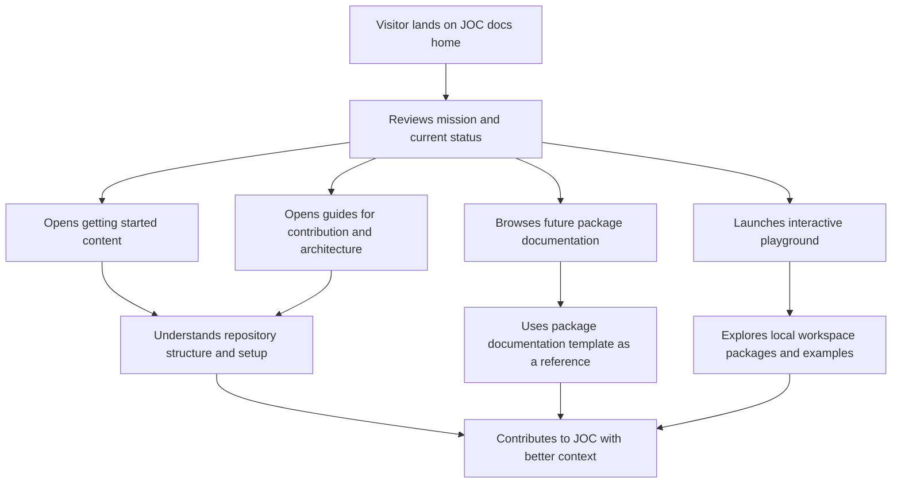

## 1. Product Overview

JOC Phase 1.4 establishes the developer experience platform for the ecosystem through a professional documentation site and a local interactive playground.

- The platform should help contributors and future users understand the repository, package philosophy, and package growth model without relying on unfinished package features.
- Its value is in making JOC feel like a credible, maintainable open-source ecosystem before the first public package release.

## 2. Core Features

### 2.1 Feature Module

1. **Documentation home page**: hero, mission, ecosystem overview, package categories, roadmap, and contribution entry points.
2. **Getting started section**: introduction, installation, philosophy, and ecosystem orientation for new contributors and users.
3. **Guides section**: first-package workflow, monorepo explanation, contribution guidance, and architecture explanation.
4. **Package documentation template section**: consistent placeholder documentation pages for planned packages.
5. **API, roadmap, and changelog sections**: reserved structured areas that can grow without changing the navigation model.
6. **Interactive playground application**: local Vite app for manual testing, future demos, and workspace package exploration.
7. **Examples infrastructure**: structured example placeholders that explain future examples without shipping feature code.

### 2.2 Page Details

| Page Name             | Module Name                     | Feature description                                                                                                                                 |
| --------------------- | ------------------------------- | --------------------------------------------------------------------------------------------------------------------------------------------------- |
| Documentation home    | Hero                            | Presents JOC’s mission, current status, roadmap, and contribution direction without overstating package maturity.                                   |
| Documentation home    | Package categories              | Groups future packages into understandable categories so the ecosystem feels intentional.                                                           |
| Getting started pages | Orientation content             | Helps a new contributor understand what JOC is, how it is organized, and how to navigate the repo within minutes.                                   |
| Guide pages           | Contributor guidance            | Explains the monorepo, package expectations, architecture decisions, and how future packages should be added.                                       |
| Package pages         | Reusable documentation template | Uses a consistent structure for introduction, installation, quick start, API, events, examples, configuration, browser support, FAQ, and migration. |
| Roadmap pages         | Milestone communication         | Mirrors the repository roadmap with documentation-friendly language and context.                                                                    |
| Changelog pages       | Release readiness               | Creates a documentation surface for future release communication without adding package release logic yet.                                          |
| Playground app        | Workspace package consumption   | Loads local workspace packages directly so future packages can be explored before publication.                                                      |
| Playground app        | Example navigation              | Provides a simple shell for future examples, API probes, demos, and manual validation scenarios.                                                    |
| Examples directory    | Placeholder example docs        | Explains the intended purpose of future examples for browser-session, request, theme, scroll, and forms.                                            |

## 3. Core Process

The core user flow starts on the documentation landing page, where a contributor or early adopter learns what JOC is, what exists today, and where to go next. From there, the user can move into getting-started content for orientation, deeper guides for architecture and contribution, package pages for future package-specific docs, or the playground for hands-on exploration of local workspace packages once they exist. Maintainers use the same platform to keep documentation consistent as the ecosystem grows.

## 4. User Interface Design

### 4.1 Design Style

- Primary colors: deep charcoal, warm off-white, muted steel, and a focused electric accent for calls to action.
- Button style: crisp rounded rectangles with restrained hover motion and clear hierarchy.
- Fonts and sizes: editorial-style display typography paired with a highly readable documentation body font.
- Layout style: desktop-first, structured, airy, and content-led with strong scanability and clear section boundaries.
- Icon style suggestions: minimal line icons or subtle geometric markers rather than decorative illustrations.

### 4.2 Page Design Overview

| Page Name           | Module Name            | UI Elements                                                                                                                     |
| ------------------- | ---------------------- | ------------------------------------------------------------------------------------------------------------------------------- |
| Documentation home  | Hero                   | Large editorial heading, succinct supporting copy, primary and secondary actions, restrained gradients, and structured spacing. |
| Documentation home  | Mission and philosophy | Split content blocks, strong headings, and concise explanatory text.                                                            |
| Documentation home  | Package categories     | Card or grid layout showing package families and future direction.                                                              |
| Documentation pages | Sidebar and content    | Stable navigation, readable measure, code-friendly spacing, and table styling that supports long-term docs growth.              |
| Package pages       | Template sections      | Reusable section ordering and consistent content placeholders for future package docs.                                          |
| Playground          | Shell layout           | Simple header, example list, main preview area, and neutral styling optimized for experimentation over branding.                |

### 4.3 Responsiveness

The experience should be desktop-first while remaining mobile-adaptive. Documentation pages should preserve readability on narrow screens, and playground controls should stack cleanly without sacrificing usability.
