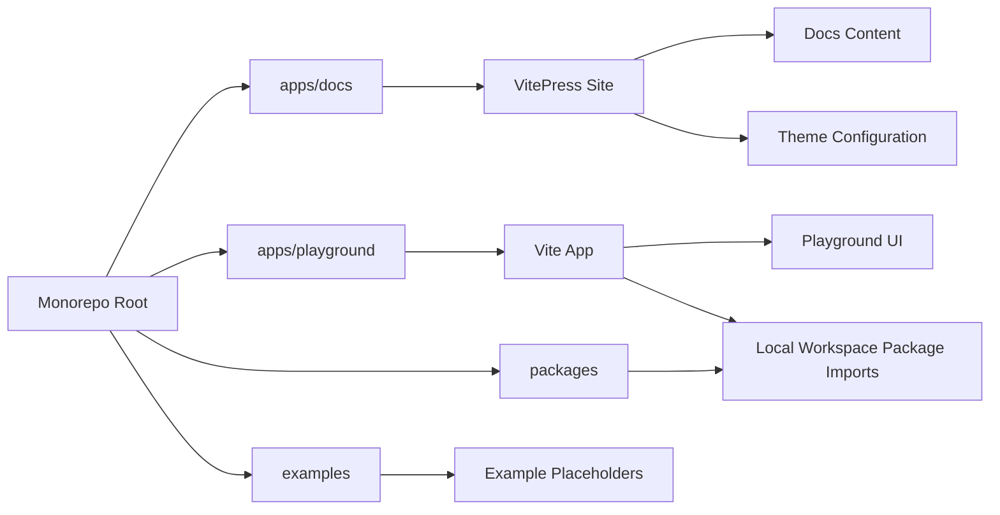

## 1. Architecture Design

## 2. Technology Description

- Frontend documentation: VitePress with TypeScript-aware configuration where appropriate
- Frontend playground: Vite + TypeScript
- Initialization approach: lightweight manual workspace setup within the existing pnpm monorepo
- Backend: None
- Data layer: None; all current content is filesystem-based markdown and local static configuration
- External services: None required for Phase 1.4; rely on local search, local content, and repository links

## 3. Route Definitions

| Route                           | Purpose                                                                                                       |
| ------------------------------- | ------------------------------------------------------------------------------------------------------------- |
| `/`                             | Documentation landing page with mission, philosophy, package overview, roadmap, and contribution entry points |
| `/getting-started/introduction` | Introduces JOC and explains the repository’s purpose                                                          |
| `/getting-started/installation` | Explains repository setup and workspace expectations                                                          |
| `/getting-started/philosophy`   | Documents package and ecosystem philosophy                                                                    |
| `/getting-started/ecosystem`    | Explains how JOC is organized and expected to grow                                                            |
| `/guides/first-package`         | Describes how a future package should be introduced into the monorepo                                         |
| `/guides/monorepo`              | Explains workspace structure and why the monorepo exists                                                      |
| `/guides/contribution`          | Describes contributor workflow and expectations                                                               |
| `/guides/architecture`          | Summarizes architectural decisions in documentation form                                                      |
| `/packages/:package-name/`      | Placeholder documentation entry for each planned public package                                               |
| `/api/`                         | Reserved index for future API reference content                                                               |
| `/roadmap/`                     | Documentation-facing roadmap entry point                                                                      |
| `/changelog/`                   | Documentation-facing changelog entry point                                                                    |
| Playground root                 | Local Vite app entry for future manual testing and examples                                                   |

## 4. Implementation Structure

- `apps/docs/package.json`: VitePress scripts and local documentation app metadata
- `apps/docs/docs/`: Markdown content tree for homepage, guides, packages, API, roadmap, and changelog
- `apps/docs/docs/.vitepress/config.ts`: navigation, sidebar, metadata, social links, footer, edit links, and theme-level setup
- `apps/docs/docs/.vitepress/theme/`: optional theme extension for small branding or layout adjustments
- `apps/playground/package.json`: Vite playground scripts and workspace app metadata
- `apps/playground/src/`: lightweight app shell, components, example registry, pages, and styles
- `examples/`: placeholder markdown documents describing future example areas

## 5. Integration Strategy

- The docs site remains content-first and static so it can scale without backend complexity.
- The playground imports local workspace packages using monorepo-aware path resolution and Vite aliases.
- Shared TypeScript settings should be reused from the root where possible, but app-local tsconfig files should keep docs and playground isolated from package build concerns.
- The repository root scripts should gain docs and playground commands without disrupting existing quality automation.

## 6. Documentation System Standards

- Package documentation pages should follow one consistent template to avoid drift as the ecosystem grows.
- Navigation must stay shallow enough for discoverability while still supporting dozens of future packages.
- The homepage should acknowledge current status honestly and avoid presenting placeholder packages as complete products.
- The system should be prepared for future versioning, but no versioned content infrastructure is required yet.

## 7. Performance and Maintainability

- Prefer native VitePress and Vite capabilities over extra dependencies.
- Keep the playground intentionally simple so it remains a developer tool, not a parallel product.
- Use static markdown and local configuration for most documentation behavior.
- Avoid feature implementation code in package directories during this phase.
