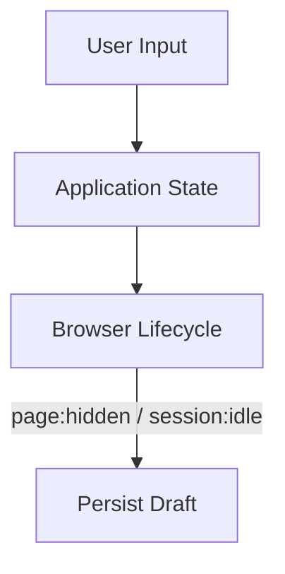

# Auto Save

Save user input when the session becomes idle or the page is hidden.

## Architecture



## Implementation

```ts
lifecycle.on("page:hidden", () => saveDraft());
lifecycle.on("session:idle", () => saveDraft());
```

## Best practices

Debounce saves and avoid writing on every keystroke.

## Playground

[Idle Playground](/playground/browser-lifecycle/idle) · [Visibility Playground](/playground/browser-lifecycle/visibility)
