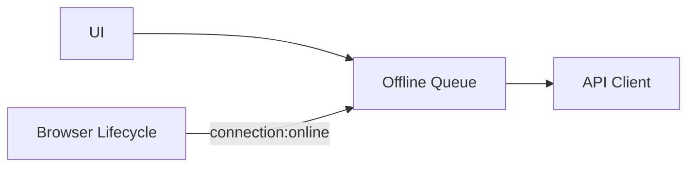

# Offline First

Queue mutations while offline and flush when online.

## Architecture

```mermaid
flowchart LR
  UI[UI] --> Queue[Offline Queue]
  BL[Browser Lifecycle] -->|connection:online| Queue
  Queue --> API[API Client]
```

## Playground

[Connectivity Playground](/playground/browser-lifecycle/connectivity)
