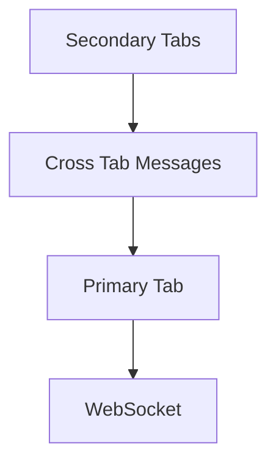

# Shared WebSocket

Maintain one WebSocket connection in the primary tab.

## Architecture

## Related

- [Leader Election](/packages/browser-lifecycle/patterns/leader-election)
- [Cross Tab Playground](/playground/browser-lifecycle/cross-tab)
