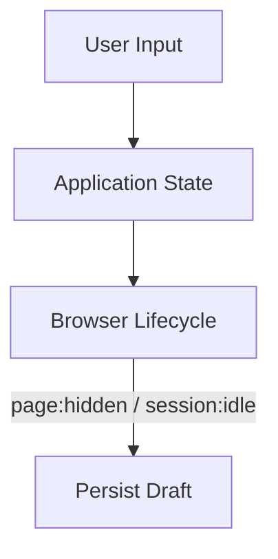

# Auto Save

Save user input when the session becomes idle or the page is hidden.

## Architecture



## With Form Intelligence (recommended)

**Composition without coupling** — use the FI plugin + optional peer:

See [Form Intelligence → Draft on tab hide](/packages/form-intelligence/modules/patterns#composition-draft-on-tab-hide-browser-lifecycle).

```ts
createBrowserLifecyclePlugin({
  saveDraftOnHidden: true,
  lifecycle, // optional shared session
});
```

## Manual wiring

```ts
lifecycle.on("page:hidden", () => saveDraft());
lifecycle.on("session:idle", () => saveDraft());
```

## Best practices

Debounce saves and avoid writing on every keystroke. Prefer drafts over writing the full document on every `page:hidden` if the payload is large.

## Playground

[Idle Playground](/playground/browser-lifecycle/idle) · [Visibility Playground](/playground/browser-lifecycle/visibility) · [FI Workflow](/playground/form-intelligence/workflow)
