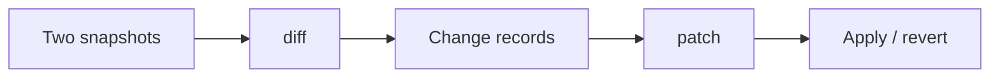

# Object Diff

**Compare structured data, report changes, and apply JSON Patch** — built for state snapshots, undo stacks, and change tracking.

::: info What does it do?
Give it two objects (before & after). It tells you **what changed**, and can produce **JSON Patch** operations to apply those changes elsewhere.
:::

## Start here — 5-minute picture



| Step | What you get                        | Time        |
| ---- | ----------------------------------- | ----------- |
| 1    | See what changed between objects    | ~2 min      |
| 2    | Quick dirty-check without full diff | ~3 min      |
| 3    | Generate & apply JSON Patch         | ~5 min      |
| 4    | Export as JSON or Markdown          | when needed |

**New to the package?** Follow the [step-by-step tutorial](/packages/object-diff/modules/getting-started).

**Want the mental model first?** Read [core concepts](/packages/object-diff/modules/concepts) (3-minute read).

## Learning path

Work through these in order. Each guide links to a live playground demo.

### Beginner — compare two objects

| #   | Guide                                                     | You will learn                | Try it live                                     |
| --- | --------------------------------------------------------- | ----------------------------- | ----------------------------------------------- |
| 1   | [Tutorial](/packages/object-diff/modules/getting-started) | Install, run your first diff  | [Playground →](/playground/object-diff/)        |
| 2   | [Core concepts](/packages/object-diff/modules/concepts)   | Snapshots, changes, patch ops | [Diff explorer →](/playground/object-diff/diff) |

### Intermediate — production workflows

| #   | Guide                                           | You will learn                             | Try it live                                       |
| --- | ----------------------------------------------- | ------------------------------------------ | ------------------------------------------------- |
| 3   | [Diffing](/packages/object-diff/modules/diff)   | `diff()`, `hasChanges()`, options          | [Diff explorer →](/playground/object-diff/diff)   |
| 4   | [Patching](/packages/object-diff/modules/patch) | `patch()`, `applyPatch()`, `revertPatch()` | [Patch explorer →](/playground/object-diff/patch) |

### Advanced — output & tooling

| #   | Guide                                                    | You will learn               | Try it live                                         |
| --- | -------------------------------------------------------- | ---------------------------- | --------------------------------------------------- |
| 5   | [Serialization](/packages/object-diff/modules/serialize) | JSON, Markdown, table export | [JSON viewer →](/playground/object-diff/json)       |
| 6   | Performance                                              | Large object benchmarks      | [Benchmarks →](/playground/object-diff/performance) |

## Install

```bash
npm install @jayoncode/object-diff
```

Copy-paste starter:

```ts
import { diff } from "@jayoncode/object-diff";

const before = { name: "John", active: true };
const after = { name: "Jane", active: true };

const result = diff(before, after);
console.log(result.changes); // typed change records
```

## Is this the right package for you?

| You need…                 | Object Diff helps         |
| ------------------------- | ------------------------- |
| Form/state dirty checking | `hasChanges(a, b)`        |
| Audit trail of edits      | `diff()` change records   |
| Sync partial updates      | JSON Patch via `patch()`  |
| Human-readable changelogs | `serialize()` to Markdown |

::: tip Not sure yet?
Open the [interactive playground](/playground/object-diff/) and try the Diff explorer with sample objects.
:::

## Reference

- [API Reference](/packages/object-diff/api/) — generated TypeDoc
- [Playground guide](/packages/object-diff/playground/playground) — local setup & routes
- [Examples](/playground/object-diff/examples) — copy-paste snippets

