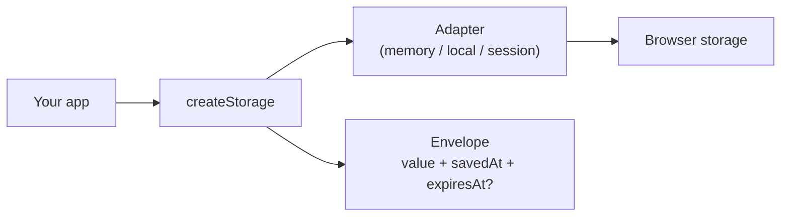

# Package overview

Persist app data in the browser — with namespaces, expiry, and schema upgrades — without reinventing `localStorage` helpers.

Think of Storage as a **small policy layer** on top of an adapter you choose (memory, `localStorage`, or `sessionStorage`). You call `set` / `get`; Storage wraps values in an **envelope** (metadata + your data).

::: tip Start here
**New to the package?** → [Tutorial](/packages/storage/modules/getting-started) (10 minutes)  
**Know localStorage already?** → skim [Core concepts](/packages/storage/modules/concepts), then [Recipes](/packages/storage/modules/recipes)  
**Need the full API?** → [Core](/packages/storage/modules/core) · [TypeDoc](/packages/storage/api/)
:::

## In one minute

```ts
import { createStorage, createLocalStorageAdapter } from "@jayoncode/storage";

const storage = createStorage({
  namespace: "app", // all keys live under "app:…"
  adapter: createLocalStorageAdapter(),
});

storage.set("theme", "dark");
storage.get("theme"); // "dark" | null
```

That is enough for many apps. Everything else (TTL, policies, migrate, cleanup, …) is **optional**.

[Try it in the Lab →](/playground/storage/)

## Pick your path

| You are…                                        | Read this                                                                                                     | Then                                                                                                                      |
| ----------------------------------------------- | ------------------------------------------------------------------------------------------------------------- | ------------------------------------------------------------------------------------------------------------------------- |
| **Beginner** — first time using Storage         | [Tutorial](/packages/storage/modules/getting-started)                                                         | [Concepts](/packages/storage/modules/concepts) → [Recipes](/packages/storage/modules/recipes)                             |
| **Shipping an app** — prefs, cache, SSR         | [Core](/packages/storage/modules/core) · [Errors](/packages/storage/modules/errors)                           | [Best practices](/packages/storage/modules/best-practices) · [Browser support](/packages/storage/modules/browser-support) |
| **Advanced** — GC, backup, events, batch writes | [Maintenance](/packages/storage/modules/maintenance) → [Transactions](/packages/storage/modules/transactions) | [Diagnostics](/packages/storage/modules/diagnostics) · [Composition](/packages/storage/modules/composition)               |

## When to use

- Theme / UI prefs that should survive reload
- Short-lived cache next to longer-lived prefs
- Explicit backends: memory in tests, `localStorage` in the browser
- Optional: cleanup expired keys, export/import, in-process watchers, same-tab transactions

## When not to use

| Need                            | Use instead                                                                       |
| ------------------------------- | --------------------------------------------------------------------------------- |
| Live UI state (React/Vue store) | Your framework state                                                              |
| Form draft UX                   | [Form Intelligence](/packages/form-intelligence/)                                 |
| Big / queryable data, IndexedDB | Not in v1 (sync Web Storage shape only)                                           |
| Passwords / tokens              | Don’t put secrets in web storage ([Security](/packages/storage/modules/security)) |

## Install

```bash
npm install @jayoncode/storage
```

```bash
pnpm add @jayoncode/storage
```

```bash
yarn add @jayoncode/storage
```

## Example: prefs vs cache (policies)

Named policies are just reusable TTL presets — beginners can skip them and pass `{ ttl: … }` on each `set`.

```ts
import { createStorage, createLocalStorageAdapter } from "@jayoncode/storage";

const storage = createStorage({
  namespace: "app",
  adapter: createLocalStorageAdapter(),
  policies: {
    preferences: { ttl: { days: 365 } },
    cache: { ttl: { minutes: 15 } },
  },
});

storage.set("theme", "dark", { policy: "preferences" });
storage.set("feed", data, { policy: "cache" });
```

## How the pieces fit



| Piece         | Plain English                                |
| ------------- | -------------------------------------------- |
| **Namespace** | Folder name for keys (`app:theme`)           |
| **Adapter**   | Where bytes live                             |
| **Envelope**  | Your value + metadata Storage stores for you |
| **Policy**    | Named default TTL for a kind of write        |
| **Subpath**   | Extra tools you import only when needed      |

## Problem → approach

| Pain today                                  | What Storage does                     |
| ------------------------------------------- | ------------------------------------- |
| Hand-rolled `JSON.parse` + key prefixes     | One `createStorage` per concern       |
| Expiry logic copied into every reader       | TTL on write; auto-drop when you read |
| Old tabs break after a schema change        | `schemaVersion` + `migrate` on `get`  |
| Core API gets huge with GC / backup / watch | Those live on **subpaths**            |

## Cheatsheet

| I want to…               | Call                          |
| ------------------------ | ----------------------------- |
| Save                     | `set(key, value)`             |
| Load                     | `get(key)` → value or `null`  |
| See expiry / version     | `peek(key)`                   |
| Check without migrating  | `has(key)`                    |
| Delete one key           | `remove(key)`                 |
| Wipe this namespace      | `clear()`                     |
| Sweep expired (advanced) | `cleanup` from `/maintenance` |

## Documentation map

### Beginner

| Guide                                                 | What you’ll learn                         |
| ----------------------------------------------------- | ----------------------------------------- |
| [Tutorial](/packages/storage/modules/getting-started) | Install → set/get/peek → first policy     |
| [Core concepts](/packages/storage/modules/concepts)   | Envelope, TTL, adapters in plain language |
| [Recipes](/packages/storage/modules/recipes)          | Copy-paste prefs, cache, lists            |

### Intermediate

| Guide                                                                                                                                                | What you’ll learn              |
| ---------------------------------------------------------------------------------------------------------------------------------------------------- | ------------------------------ |
| [Core](/packages/storage/modules/core)                                                                                                               | All options, migrate, adapters |
| [Errors](/packages/storage/modules/errors)                                                                                                           | Throws vs soft `null`          |
| [Best practices](/packages/storage/modules/best-practices)                                                                                           | Naming, SSR, what not to store |
| [FAQ](/packages/storage/modules/faq) · [Browser support](/packages/storage/modules/browser-support) · [Security](/packages/storage/modules/security) | Edge cases                     |

### Advanced

| Guide                                                  | What you’ll learn                  |
| ------------------------------------------------------ | ---------------------------------- |
| [Maintenance](/packages/storage/modules/maintenance)   | Explicit GC report                 |
| [Snapshots](/packages/storage/modules/snapshots)       | Export / restore                   |
| [Observable](/packages/storage/modules/observable)     | In-process `watch` / `on`          |
| [Diagnostics](/packages/storage/modules/diagnostics)   | DEV report / activity              |
| [Transactions](/packages/storage/modules/transactions) | Same-tab rollback                  |
| [Composition](/packages/storage/modules/composition)   | Wire with BL / FI / OD in app code |

## Reference

- [API (TypeDoc)](/packages/storage/api/) — every export
- [Playground guide](/packages/storage/playground/playground)
- [Open Lab](/playground/storage/)
