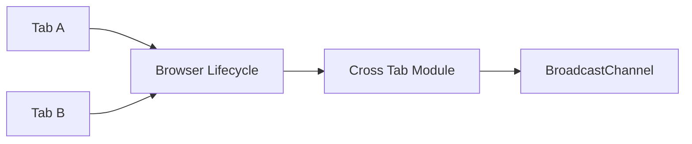

# Advanced Tutorial

Build cross-tab leader election with shared messaging.

## Goal

Elect a primary tab that owns background sync while secondary tabs stay passive.

## Architecture



## Step 1 — Enable cross-tab coordination

```ts
const lifecycle = createBrowserLifecycle({
  autoStart: true,
  crossTab: { enabled: true },
});
```

## Step 2 — React to leadership changes

```ts
lifecycle.on("tab:primary", () => {
  startBackgroundSync();
});

lifecycle.on("tab:secondary", () => {
  stopBackgroundSync();
});
```

## Step 3 — Broadcast messages

```ts
lifecycle.on("tab:message", (event) => {
  console.log("message from", event.metadata.tabId, event.metadata.payload);
});
```

Use the session API exposed by the cross-tab module to publish messages from the primary tab.

## Testing recommendations

- Open two tabs locally and verify only one receives `tab:primary`
- Close the primary tab and confirm promotion
- Use the [Cross Tab Playground](http://127.0.0.1:4273/cross-tab)

## Related patterns

- [Leader Election](/patterns/leader-election)
- [Shared WebSocket](/patterns/shared-websocket)
- [State Synchronization](/patterns/state-synchronization)
