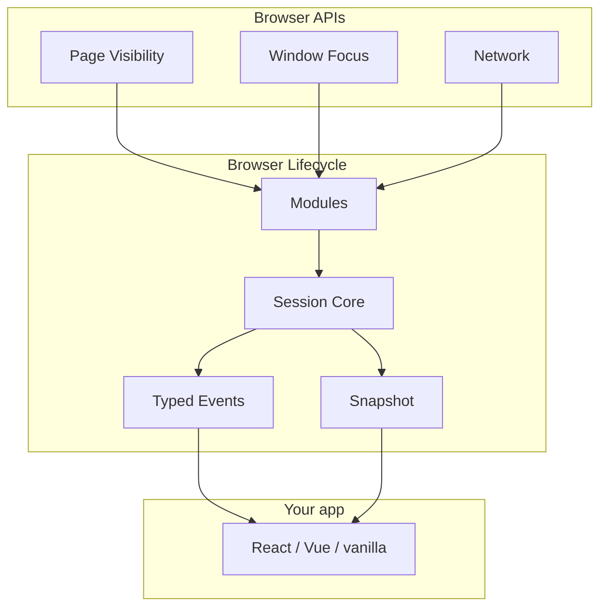

# Core concepts

A 3-minute mental model before you dive into code.

**Previous:** [Overview](/packages/browser-lifecycle/) · **Next:** [Tutorial](/packages/browser-lifecycle/modules/getting-started)

## One session per tab

Everything starts with `createBrowserLifecycle()`. You get a **session** that:

- Listens to browser APIs (visibility, focus, network, idle, …)
- Normalizes them into **typed events**
- Exposes a readonly **snapshot** of current state
- Cleans up when you call `dispose()`

```ts
const lifecycle = createBrowserLifecycle({ autoStart: true });
```

Use **one instance per browser tab** — not one per component.

## How pieces connect



| Piece    | Plain English                               | API                              |
| -------- | ------------------------------------------- | -------------------------------- |
| Session  | The running lifecycle instance              | `createBrowserLifecycle()`       |
| Event    | Something happened (tab hidden, offline, …) | `lifecycle.on("page:hidden", …)` |
| Snapshot | Current state right now                     | `lifecycle.getSnapshot()`        |
| Module   | One browser concern (visibility, idle, …)   | Enabled via configuration        |
| Plugin   | Extend behavior without forking core        | Plugin registration API          |

## Session phases

| Phase      | Meaning                           |
| ---------- | --------------------------------- |
| `created`  | Instance exists, not yet running  |
| `running`  | Listening to browser events       |
| `stopped`  | Paused, listeners may be detached |
| `disposed` | Fully torn down — do not reuse    |

## What comes next?

| If you want to…           | Go to                                                           |
| ------------------------- | --------------------------------------------------------------- |
| Create your first session | [Tutorial](/packages/browser-lifecycle/modules/getting-started) |
| Handle tab visibility     | [Visibility](/packages/browser-lifecycle/modules/visibility)    |
| Subscribe to all events   | [Events](/packages/browser-lifecycle/modules/events)            |

::: tip Try it
Open the [State explorer](/playground/browser-lifecycle/state) — switch tabs and watch the snapshot update.
:::
