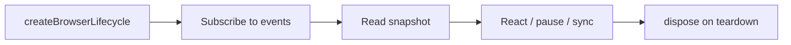

# Browser Lifecycle

<BrowserLifecycleVersion />

**Typed browser session lifecycle** — visibility, focus, connectivity, idle detection, cross-tab sync, plugins, and diagnostics in one headless API.

::: info What is it?
One `createBrowserLifecycle()` instance per tab orchestrates browser signals. You subscribe to **typed events** and read a **readonly snapshot** — no scattered `document.addEventListener` calls across your app.
:::

## Start here — 5-minute picture



| Step | What you get                      | Time        |
| ---- | --------------------------------- | ----------- |
| 1    | Running session with typed events | ~2 min      |
| 2    | Visibility & focus signals        | ~5 min      |
| 3    | Full snapshot & modules           | ~10 min     |
| 4    | Plugins, cross-tab, idle          | when needed |

**New to the package?** Follow the [step-by-step tutorial](/packages/browser-lifecycle/modules/getting-started).

**Want the mental model first?** Read [core concepts](/packages/browser-lifecycle/modules/concepts) (3-minute read).

## Learning path

### Beginner — your first session

| #   | Guide                                                           | You will learn                              | Try it live                                             |
| --- | --------------------------------------------------------------- | ------------------------------------------- | ------------------------------------------------------- |
| 1   | [Tutorial](/packages/browser-lifecycle/modules/getting-started) | Install, create session, subscribe, dispose | [Playground →](/playground/browser-lifecycle/)          |
| 2   | [Core concepts](/packages/browser-lifecycle/modules/concepts)   | Session, snapshot, events, modules          | [State explorer →](/playground/browser-lifecycle/state) |

### Intermediate — browser signals

| #   | Guide                                                            | You will learn                     | Try it live                                              |
| --- | ---------------------------------------------------------------- | ---------------------------------- | -------------------------------------------------------- |
| 3   | [Visibility](/packages/browser-lifecycle/modules/visibility)     | Page hidden/visible events         | [Visibility →](/playground/browser-lifecycle/visibility) |
| 4   | [Events](/packages/browser-lifecycle/modules/events)             | Subscribe, unsubscribe, event feed | [Events →](/playground/browser-lifecycle/events)         |
| 5   | [Session core](/packages/browser-lifecycle/modules/session-core) | Lifecycle phases, startup ordering | [Lifecycle →](/playground/browser-lifecycle/lifecycle)   |

### Advanced — configuration & extension

| #   | Guide                                                                          | You will learn                   | Try it live                                                        |
| --- | ------------------------------------------------------------------------------ | -------------------------------- | ------------------------------------------------------------------ |
| 6   | [Core infrastructure](/packages/browser-lifecycle/modules/core-infrastructure) | Config, capabilities, SSR safety | [Configuration →](/playground/browser-lifecycle/configuration)     |
| 7   | [Usage guide](/packages/browser-lifecycle/guides/usage)                        | Production patterns              | [Developer tools →](/playground/browser-lifecycle/developer-tools) |
| 8   | [Plugins](/packages/browser-lifecycle/playground/plugin-playground)            | Custom module registration       | [Plugins →](/playground/browser-lifecycle/plugins)                 |

## Install

```bash
npm install @jayoncode/browser-lifecycle
```

Copy-paste starter:

```ts
import { createBrowserLifecycle } from "@jayoncode/browser-lifecycle";

const lifecycle = createBrowserLifecycle({ autoStart: true });

lifecycle.on("page:visible", () => console.log("visible"));
lifecycle.on("page:hidden", () => console.log("hidden"));

// later: await lifecycle.dispose();
```

## Is this the right package for you?

| You need…                   | Browser Lifecycle helps        |
| --------------------------- | ------------------------------ |
| Pause video when tab hidden | `page:hidden` / `page:visible` |
| Resume work on focus        | `window:focus` events          |
| Offline-aware UI            | `connectivity:offline`         |
| Idle timeout                | Built-in idle module           |
| Cross-tab leader election   | Cross-tab sync module          |
| SSR-safe initialization     | Capability detection utilities |

::: tip Not sure yet?
Open the [interactive playground](/playground/browser-lifecycle/) and switch tabs on the Visibility page.
:::

## More resources

| Resource           | Link                                                                  |
| ------------------ | --------------------------------------------------------------------- |
| API Reference      | [TypeDoc](/packages/browser-lifecycle/api/)                           |
| Framework examples | [Examples](/packages/browser-lifecycle/examples/)                     |
| Best practices     | [Guide](/packages/browser-lifecycle/best-practices/)                  |
| Common patterns    | [Patterns](/packages/browser-lifecycle/patterns/)                     |
| FAQ                | [FAQ](/packages/browser-lifecycle/faq/)                               |
| Playground setup   | [Playground guide](/packages/browser-lifecycle/playground/playground) |

## Version

<BrowserLifecycleVersion mode="overview" />
