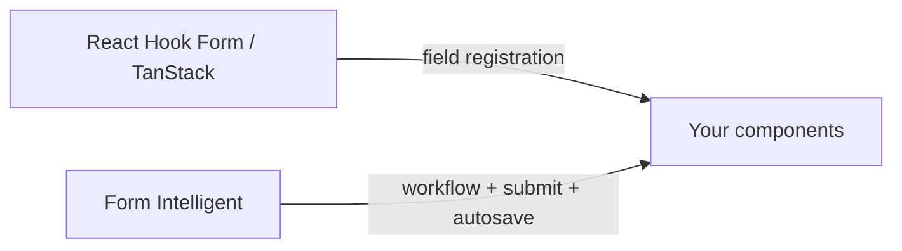

# Adapters

Use Form Intelligent with your existing UI stack — today with headless HTML, tomorrow with framework packages.

**Previous:** [Plugins](/packages/form-intelligent/modules/plugins) · **Back to:** [Overview](/packages/form-intelligent/)

::: tip Try it first
[Open Adapters playground →](/playground/form-intelligent/adapters) — see what's available now vs planned.
:::

## In plain English

Form Intelligent **does not register fields for you** (that's React Hook Form / TanStack Form territory). Adapters translate between your framework and `createForm()`.

---

## Available today — headless HTML

Works in any environment. No extra package:

```ts
const binding = form.field("email").bind();

<input
  name={binding.name}
  value={binding.value}
  onChange={(e) => binding.onChange(e.target.value)}
  onBlur={binding.onBlur}
/>
```

---

## Coming soon

| Package                             | What it adds                                    |
| ----------------------------------- | ----------------------------------------------- |
| `@jayoncode/form-intelligent-react` | `useFormField()` hook                           |
| `@jayoncode/form-intelligent-zod`   | Zod schema → validators                         |
| Vue / Angular / Svelte              | Framework-native composables                    |
| RHF / TanStack bridges              | Keep field registration; delegate workflow here |

---

## How to think about it



Use **both** when you want RHF ergonomics **and** workflow orchestration.

---

## Schema adapter (advanced)

Bridge any validation library via `SchemaAdapter`:

```ts
const adapter: SchemaAdapter = {
  validate: async (values) => {
    // return { fieldPath: "error message" }
    return {};
  },
};
```

**Done with the guides?** Browse the [API Reference](/packages/form-intelligent/api/) or explore [all playground routes](/playground/form-intelligent/).
