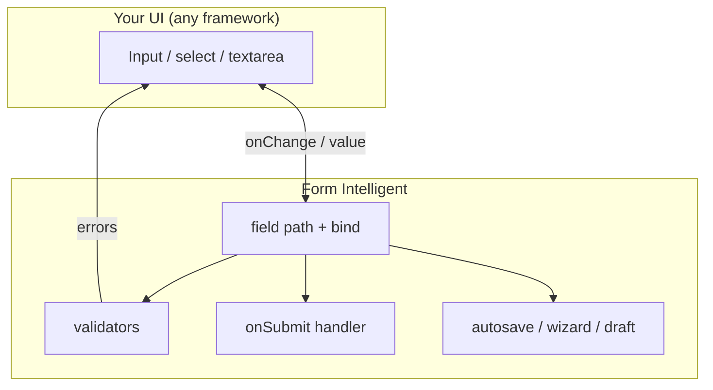

# Core concepts

A 3-minute mental model before you dive into code.

**Previous:** [Overview](/packages/form-intelligent/) · **Next:** [Tutorial](/packages/form-intelligent/modules/getting-started)

## One object runs the show

Everything starts with `createForm()`. You get back a **form instance** — a single object that holds:

- **Values** — what the user typed
- **Errors** — what is wrong per field
- **Flags** — touched, dirty, visited (for UX)
- **Workflow** — autosave, drafts, wizard step (optional)

```ts
const form = createForm({ initialValues: { email: "" } });
```

Think of it as a small state machine for your form — not a React component.

## How pieces connect



| Piece     | Plain English                     | API                                        |
| --------- | --------------------------------- | ------------------------------------------ |
| Field     | One input in your form            | `form.field("email")`                      |
| Binding   | Wire an input without a framework | `field().bind()`                           |
| Validator | Rule that returns an error or OK  | `validators: { email: [required, email] }` |
| Submit    | Your API call when form is valid  | `onSubmit: async (values) => …`            |
| Workflow  | Extra orchestration on top        | `workflow: { autosave, draft, wizard }`    |

## Field state flags (for better UX)

| Flag      | Meaning                    | Typical use                |
| --------- | -------------------------- | -------------------------- |
| `touched` | User left the field        | Show error only after blur |
| `dirty`   | Value changed from default | "Unsaved changes" warning  |
| `visited` | User focused the field     | Analytics or help text     |

Inspect all flags live in the [State explorer](/playground/form-intelligent/state).

## Headless = you render, we orchestrate

Form Intelligent **does not** ship `<TextField>` components.

```ts
const binding = form.field("email").bind();
// binding.name, binding.value, binding.onChange, binding.onBlur
```

You pass those to whatever UI you already use. Framework adapters (React, Vue, etc.) are optional sugar on top.

## What comes next?

| If you want to…                  | Go to                                                          |
| -------------------------------- | -------------------------------------------------------------- |
| Write your first form end-to-end | [Tutorial](/packages/form-intelligent/modules/getting-started) |
| Add validation rules             | [Validation](/packages/form-intelligent/modules/validation)    |
| Handle submit + loading          | [Submission](/packages/form-intelligent/modules/submission)    |
| Add autosave or wizards          | [Workflow](/packages/form-intelligent/modules/workflow)        |

::: tip Try it
Open the [State explorer](/playground/form-intelligent/state), edit a field, and watch values + flags update in real time.
:::
