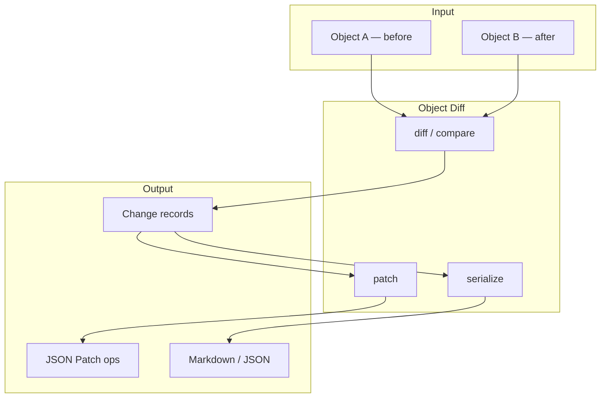

# Core concepts

A 3-minute mental model before you dive into code.

**Previous:** [Overview](/packages/object-diff/) · **Next:** [Tutorial](/packages/object-diff/modules/getting-started)

## Snapshots in, changes out

Object Diff compares two **snapshots** of data — usually a "before" and "after" state:

```ts
const before = { user: { name: "John" }, count: 1 };
const after = { user: { name: "Jane" }, count: 1 };

const result = diff(before, after);
```

The result contains **change records** — each describes one mutation (update, add, remove) with a path and values.

## How pieces connect



| API                         | Plain English              | When to use                       |
| --------------------------- | -------------------------- | --------------------------------- |
| `diff(a, b)`                | Full structured comparison | Debugging, audit logs             |
| `hasChanges(a, b)`          | Quick boolean check        | Dirty flags, skip re-render       |
| `compare(a, b)`             | Equality with path details | Testing                           |
| `patch(diffResult)`         | RFC 6902 operations        | Send minimal updates over network |
| `applyPatch(target, ops)`   | Apply ops to an object     | Sync remote state                 |
| `serialize(result, format)` | Pretty output              | Docs, CLI, UI                     |

## Change record anatomy

Each change has:

- **path** — where in the object (e.g. `user.name`)
- **type** — `update`, `add`, or `remove`
- **value** / **oldValue** — new and previous data

## What comes next?

| If you want to…           | Go to                                                     |
| ------------------------- | --------------------------------------------------------- |
| Run your first comparison | [Tutorial](/packages/object-diff/modules/getting-started) |
| Master diff options       | [Diffing](/packages/object-diff/modules/diff)             |
| Generate & apply patches  | [Patching](/packages/object-diff/modules/patch)           |

::: tip Try it
Open the [Diff explorer](/playground/object-diff/diff) — edit JSON on both sides and watch changes appear live.
:::
