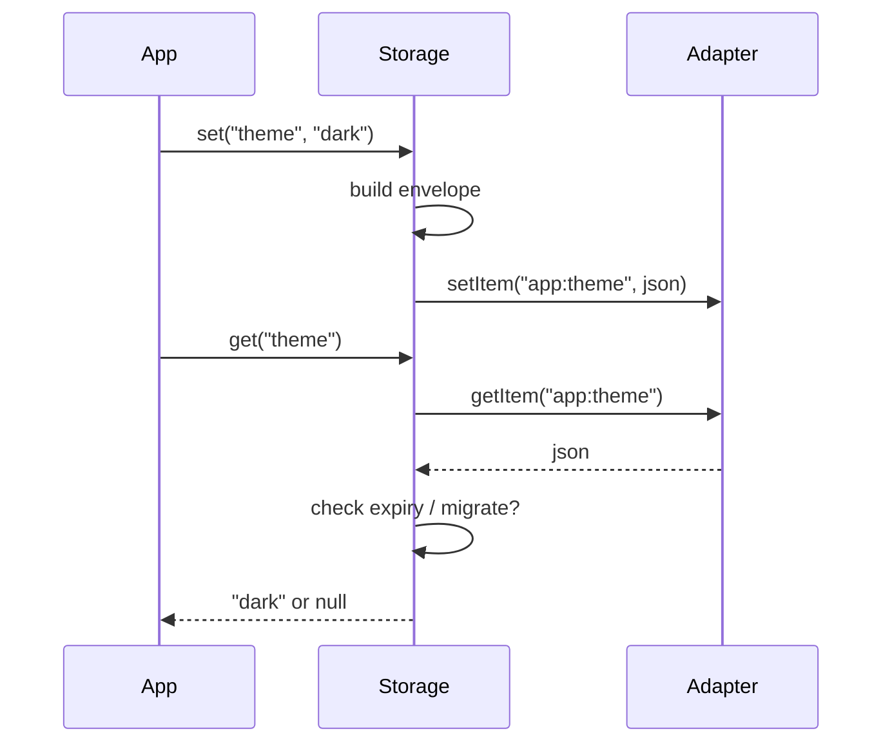

# Core concepts

How Storage thinks — in plain language first, then the precise terms.

**Previous:** [Tutorial](/packages/storage/modules/getting-started) · **Next:** [Core](/packages/storage/modules/core)

::: tip Beginner tip
If you have not run the [Tutorial](/packages/storage/modules/getting-started) yet, do that first. This page explains _why_ the APIs behave the way they do.
:::

## The big idea

Without Storage, apps usually do this:

1. Pick a string key
2. `JSON.stringify` a value
3. Hope nobody else used the same key
4. Hand-roll expiry and migrations later

Storage does steps 2–4 for you. You still pick a **namespace** (like a folder) and an **adapter** (where the bytes live). On every `set`, Storage wraps your value in an **envelope** (value + metadata) and writes that string to the adapter.



## Glossary (quick)

| Word          | Meaning                                                               | Beginner need?                                  |
| ------------- | --------------------------------------------------------------------- | ----------------------------------------------- |
| **Namespace** | Prefix for all keys (`app:theme`)                                     | Yes — pick one per feature                      |
| **Adapter**   | Backend: memory / local / session                                     | Yes — choose where data lives                   |
| **Envelope**  | Stored JSON: your `value` + `savedAt` / `expiresAt` / `schemaVersion` | Skim; use `peek` when curious                   |
| **TTL**       | How long a write should live                                          | Optional at first                               |
| **Policy**    | Named TTL preset (`preferences`, `cache`)                             | Optional — convenience                          |
| **Migrate**   | Upgrade old shapes on `get`                                           | Advanced / when you ship breaking value changes |

## Write path (what `set` does)

```ts
storage.set("theme", "dark", { policy: "preferences" });
```

1. Resolve TTL: per-write `ttl` → policy → instance default → none
2. Build envelope (`value`, `savedAt`, optional `expiresAt`, `schemaVersion`)
3. Serialize and `adapter.setItem(`${namespace}:${key}`, …)`

You almost never touch the envelope on write — Storage builds it.

## Read path (what `get` / `peek` / `has` do)

| Call        | Returns                 | Migrates old schemas? | Drops expired? | When to use          |
| ----------- | ----------------------- | --------------------- | -------------- | -------------------- |
| `get(key)`  | Your value or `null`    | **Yes**               | Yes            | Normal app reads     |
| `peek(key)` | Full envelope or `null` | No                    | Yes            | Debug / show expiry  |
| `has(key)`  | `boolean`               | No                    | Yes            | “Is anything there?” |

::: warning Soft `null` is normal
Missing, expired, or “migrate said drop” → `null` / `false`. That is **not** an exception. See [Errors](/packages/storage/modules/errors) for what _does_ throw.
:::

## Adapters (where data lives)

| Adapter                         | Survives reload? | Typical use         |
| ------------------------------- | ---------------- | ------------------- |
| `createMemoryAdapter()`         | No               | Unit tests, SSR     |
| `createLocalStorageAdapter()`   | Yes              | Prefs, cache        |
| `createSessionStorageAdapter()` | Until tab closes | Wizard / tab-scoped |

There is **no auto-select** — you pass the adapter on purpose.

## Policies (optional shortcut)

Instead of repeating `{ ttl: { days: 365 } }` everywhere:

```ts
policies: {
  preferences: {
    ttl: {
      days: 365;
    }
  }
}
// …
storage.set("theme", "dark", { policy: "preferences" });
```

Same as passing that TTL by hand. Unknown policy names throw (programmer error).

## Subpaths (advanced tools)

Core stays small. Import extras only when you need them:

| Need                          | Import                            |
| ----------------------------- | --------------------------------- |
| Sweep expired keys + report   | `@jayoncode/storage/maintenance`  |
| Backup / restore namespace    | `@jayoncode/storage/snapshots`    |
| React to changes in-process   | `@jayoncode/storage/observable`   |
| DEV size / activity report    | `@jayoncode/storage/diagnostics`  |
| Multi-key write with rollback | `@jayoncode/storage/transactions` |
| IndexedDB / async API         | `@jayoncode/storage/async`        |
| Cross-tab notify              | `@jayoncode/storage/cross-tab`    |

## Next

| Level             | Go to                                        |
| ----------------- | -------------------------------------------- |
| Still learning    | [Recipes](/packages/storage/modules/recipes) |
| Need every option | [Core](/packages/storage/modules/core)       |
| Handling failures | [Errors](/packages/storage/modules/errors)   |
